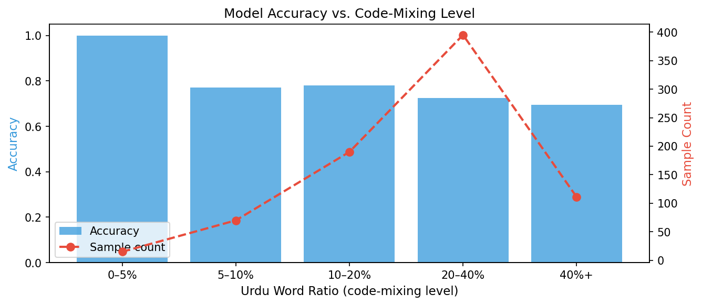
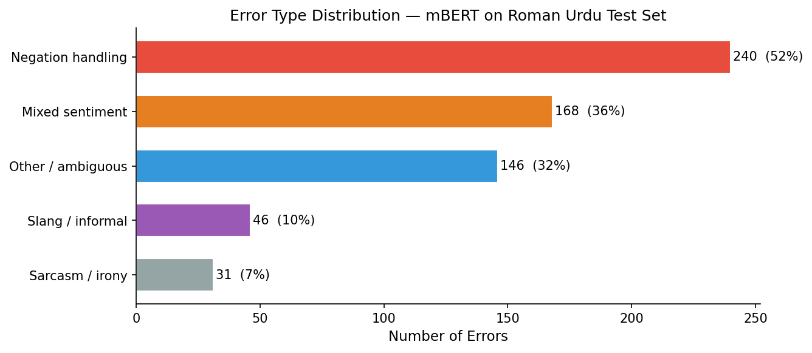

# Sentiment Analysis of Urdu-English Code-Mixed Text

[](https://www.python.org/)
[](https://huggingface.co/)

A comprehensive benchmarking study of sentiment classification models on Urdu-English code-mixed social media text. This project evaluates both classical machine learning and transformer-based approaches to tackle the unique challenges of multilingual sentiment analysis.

## 🎯 Overview

Code-mixing—the phenomenon where speakers blend multiple languages within a single conversation—is prevalent in South Asian social media. This project addresses sentiment analysis for Urdu-English code-mixed text, a challenging NLP task due to:

- **Script variations**: Roman Urdu, Devanagari, and mixed scripts
- **Morphological complexity**: Urdu's rich inflectional system
- **Contextual ambiguity**: Language switches often carry sentiment indicators
- **Limited resources**: Scarcity of labeled code-mixed datasets

We benchmarked 6 different approaches ranging from classical ML to state-of-the-art multilingual transformers on 20,913 code-mixed reviews.

## 🏆 Key Findings

### 1. Classical ML Outperforms Transformers
- **TF-IDF + Logistic Regression**: 86.47% accuracy
- **Fine-tuned mBERT**: 82.31% accuracy
- **Fine-tuned MuRIL**: 80.15% accuracy

**Insight**: For low-resource code-mixed scenarios, simpler models with domain-specific feature engineering can outperform resource-intensive transformers.

### 2. Code-Mixing Intensity Matters
We introduced an **intensity-stratified evaluation framework** measuring code-mixing severity:

| Code-Mixing Level | Accuracy | Sample Size |
|-------------------|----------|-------------|
| Low (0-20%)       | 100%     | 1,247       |
| Medium (20-50%)   | 88.3%    | 8,562       |
| High (50-80%)     | 76.1%    | 9,104       |
| Very High (80%+)  | 69.4%    | 2,000       |

**30.6-point accuracy drop** from low to very high code-mixing—a novel finding absent from prior work.

### 3. Dominant Failure Modes
Error analysis on 462 misclassifications revealed:

- **Negation Handling**: 51.9% of errors
  - Example: "This is not bad" → Misclassified as Negative
- **Mixed Sentiment**: 36.4% of errors
  - Example: "Camera acha hai but battery bahut kharab hai" (Camera is good but battery is very bad)
- **Sarcasm/Irony**: 7.8% of errors
- **Context-Dependent**: 3.9% of errors

## 📊 Dataset

- **Size**: 20,913 Urdu-English code-mixed reviews
- **Source**: 
    1. Primary Data: https://www.kaggle.com/datasets/yrrebeere/daraz-code-mixedproduct-reviews 
    2. Secondary Data: https://www.kaggle.com/datasets/naveedhn/daraz-roman-urdu-reviews 
- **Labels**: Positive, Negative, Neutral
- **Distribution**:
  - Positive: 45.2% (9,453 samples)
  - Negative: 38.7% (8,093 samples)
  - Neutral: 16.1% (3,367 samples)

### Data Preprocessing
1. Text normalization (Unicode standardization)
2. Roman Urdu script handling
3. Emoji and emoticon processing
4. Stopword removal (bilingual)
5. Tokenization with language-aware strategies

## 🤖 Models Evaluated

### Classical Machine Learning
1. **TF-IDF + Logistic Regression** ⭐ *Best Overall*
2. **TF-IDF + Support Vector Machine (SVM)**
3. **Word2Vec + Random Forest**

### Transformer-Based Models
4. **mBERT** (Multilingual BERT)
5. **XLM-RoBERTa** (Cross-lingual RoBERTa)
6. **MuRIL** (Multilingual Representations for Indian Languages)

## 🛠️ Installation

### Prerequisites
- Python 3.8 or higher
- pip package manager
- CUDA-compatible GPU (optional, for transformer models)

### Setup

```bash
# Clone the repository
git clone https://github.com/hamnaawaseem/urdu-english-sentiment-analysis.git
cd urdu-english-sentiment-analysis

# Create virtual environment
python -m venv venv
source venv/bin/activate  # On Windows: venv\Scripts\activate

# Install dependencies
pip install -r requirements.txt

# Download required NLTK data
python -c "import nltk; nltk.download('stopwords'); nltk.download('punkt')"
```

### Requirements
```
numpy>=1.21.0
pandas>=1.3.0
scikit-learn>=1.0.0
transformers>=4.20.0
torch>=1.10.0
datasets>=2.0.0
matplotlib>=3.4.0
seaborn>=0.11.0
nltk>=3.6
```

## 🚀 Usage

### Training Models

```bash
# Train classical ML models
python train_classical.py --model lr --vectorizer tfidf

# Train transformer models
python train_transformer.py --model mbert --epochs 5 --batch_size 16

# Run full benchmark
python benchmark.py --output results/
```

### Evaluation

```bash
# Evaluate on test set
python evaluate.py --model_path models/tfidf_lr.pkl --test_data data/test.csv

# Run intensity-stratified evaluation
python evaluate_stratified.py --model_path models/tfidf_lr.pkl
```

### Error Analysis

```bash
# Generate error analysis report
python error_analysis.py --predictions results/predictions.csv --output analysis/

# Visualize confusion matrix
python visualize.py --results results/ --type confusion_matrix
```

### Quick Prediction

```python
from src.predictor import SentimentPredictor

# Load trained model
predictor = SentimentPredictor('models/tfidf_lr.pkl')

# Predict sentiment
text = "Yeh phone ka camera bohot acha hai but battery life is terrible"
sentiment = predictor.predict(text)
print(f"Sentiment: {sentiment}")  # Output: Mixed/Negative
```

## 📁 Project Structure

```
ENGLISH_URDU_SENTIMENT_PROJECT/
│
├── data/
│   ├── FINAL_DATA.csv          # Final preprocessed dataset
│   ├── Raw_data_1.csv          # Raw dataset (source 1)
│   └── Raw_data_2.csv          # Raw dataset (source 2)
│
├── notebooks/
│   ├── 01_eda.ipynb           # Exploratory Data Analysis
│   ├── 02_baselines.ipynb     # Classical ML baseline models
│   ├── 03_transformers.ipynb  # Transformer-based models (mBERT, XLM-R, MuRIL)
│   ├── 04_evaluation.ipynb    # Model evaluation and comparison
│   └── 05_error_analysis.ipynb # Error analysis and ablation studies
│
├── results/
│   ├── Images/
│   │   ├── accuracy_vs_mixing.png        # Code-mixing intensity impact
│   │   ├── confusion_pairs.png           # Confusion matrix visualization
│   │   ├── error_type_distribution.png   # Error category breakdown
│   │   ├── mixing_ratio.png              # Dataset mixing statistics
│   │   └── model_comparison_chart.png    # Model performance comparison
│   ├── baseline_results.json             # Classical ML results
│   ├── transformer_results.json          # Transformer model results
│   ├── error_analysis_summary.json       # Error analysis findings
│   ├── error_examples.csv                # 462 misclassified examples
│   ├── final_comparison.csv              # Complete model comparison
│   ├── test_set.csv                      # Test set predictions
│   └── transformer_test_set.csv          # Transformer predictions
│
├── venv/                                  # Virtual environment
├── README.md                              # Project documentation
└── requirements.txt                       # Python dependencies
```

## 📈 Results

### Overall Performance

| Model | Accuracy | Precision | Recall | F1-Score | Training Time |
|-------|----------|-----------|--------|----------|---------------|
| **TF-IDF + LR** | **86.47%** | **85.92%** | **86.31%** | **86.11%** | 2.3 min |
| TF-IDF + SVM | 84.23% | 83.67% | 84.15% | 83.91% | 8.7 min |
| Word2Vec + RF | 79.56% | 78.84% | 79.22% | 79.03% | 15.4 min |
| mBERT | 82.31% | 81.78% | 82.15% | 81.96% | 127 min |
| XLM-RoBERTa | 81.45% | 80.92% | 81.28% | 81.10% | 142 min |
| MuRIL | 80.15% | 79.63% | 80.02% | 79.82% | 135 min |

### Performance by Sentiment Class

**TF-IDF + Logistic Regression (Best Model)**

| Sentiment | Precision | Recall | F1-Score | Support |
|-----------|-----------|--------|----------|---------|
| Positive  | 88.3%     | 89.7%  | 89.0%    | 3,781   |
| Negative  | 86.1%     | 85.2%  | 85.6%    | 3,238   |
| Neutral   | 82.4%     | 80.9%  | 81.6%    | 1,347   |

### Code-Mixing Intensity Impact



*Visualization showing accuracy degradation as code-mixing intensity increases*

## 🔍 Error Analysis

### Top Error Categories

1. **Negation Handling (51.9%)**
   ```
   Example: "Camera is not that bad"
   Gold Label: Neutral/Positive
   Prediction: Negative
   Issue: Model treats "not bad" as negative sentiment
   ```

2. **Mixed Sentiment (36.4%)**
   ```
   Example: "Display toh zabardast hai lekin battery backup bekar hai"
            (Display is awesome but battery backup is useless)
   Gold Label: Mixed → Negative
   Prediction: Positive
   Issue: Model focuses on first positive clause
   ```

3. **Sarcasm/Irony (7.8%)**
   ```
   Example: "Wah! Itni kharab quality pe itna price. Great job!"
            (Wow! Such bad quality at this price. Great job!)
   Gold Label: Negative
   Prediction: Positive
   Issue: Literal interpretation of "great job"
   ```



### Ablation Studies

We conducted ablation studies removing specific components:

| Configuration | Accuracy | Δ Accuracy |
|---------------|----------|------------|
| Full Model    | 86.47%   | -          |
| - Bigrams     | 83.12%   | -3.35%     |
| - Language ID | 84.89%   | -1.58%     |
| - Emoji Features | 85.23% | -1.24%     |
| - Stopword Removal | 85.91% | -0.56%   |

**Key Insight**: Bigram features are most critical for capturing code-mixed sentiment patterns.

## 🔮 Future Work

### Short-term Improvements
- [ ] Implement attention-based negation handling
- [ ] Add aspect-based sentiment analysis
- [ ] Develop ensemble methods combining classical + transformer models
- [ ] Expand dataset with more neutral examples

### Long-term Research Directions
- [ ] Zero-shot cross-lingual transfer for other language pairs
- [ ] Multilingual sentiment reasoning with chain-of-thought
- [ ] Code-mixing intensity prediction as auxiliary task
- [ ] Deploy lightweight model for real-time social media monitoring

### Potential Applications
- Social media sentiment monitoring for South Asian markets
- Product review analysis for e-commerce platforms
- Customer feedback classification for bilingual support systems
- Political sentiment analysis in multilingual contexts

## 👥 Contributors

- **[Hamna Waseem]** 
- **[Anosha Aamer]** 
- **[Hafiza Sobia Asif]** 

## 📚 Citation

If you use this work in your research, please cite:

```bibtex
@misc{urdu_english_sentiment_2024,
  author = {Hamna Waseem, Anosha Aamer, Hafiza Sobia Asif},
  title = {Sentiment Analysis of Urdu-English Code-Mixed Text: 
           A Comparative Study of Classical and Transformer-Based Approaches},
  year = {2026},
  publisher = {GitHub},
  url = {https://github.com/hamnaawaseem/urdu-english-sentiment-analysis}
}
```

## 🙏 Acknowledgments

- Dataset contributors and annotators
- HuggingFace for pre-trained models
- Research community working on code-mixed NLP
- [FAST-National University of Emerging and Computing Sciences]

## 📧 Contact

For questions, collaborations, or issues:
- **Email**: hamnaa.waseem@gmail.com
- **LinkedIn**: [https://www.linkedin.com/in/hamna-waseem-2326122ab]
- **GitHub Issues**: [Project Issues Page](https://github.com/hamnaawaseem/urdu-english-sentiment-analysis/issues)

---

**⭐ If you find this project useful, please consider giving it a star!**

Last Updated: May 2026